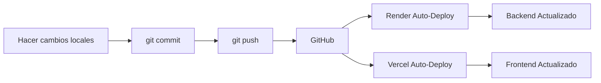

# 📊 Resumen del Despliegue - NobleStep

## 🎯 Arquitectura Desplegada

```
┌─────────────────────────────────────────────────────────────────┐
│                    FLUJO DE LA APLICACIÓN                       │
└─────────────────────────────────────────────────────────────────┘

Usuario Tienda Online → Vercel (Frontend E-commerce)
              ↓
         Render (Backend API .NET)
              ↓
    Ngrok → MySQL Local (Tu PC)


Usuario Admin → Vercel (Frontend Admin)
              ↓
         Render (Backend API .NET)
              ↓
    Ngrok → MySQL Local (Tu PC)
```

---

## 📁 Archivos Creados para Despliegue

### ✅ Configuración de Backend (Render)
- `Dockerfile` - Contenedor Docker para el backend
- `.dockerignore` - Archivos a excluir del build
- `render.yaml` - Configuración blueprint de Render

### ✅ Configuración de Frontend (Vercel)
- `vercel.json` - Configuración de Vercel
- `netlify.toml` - Alternativa para Netlify
- Scripts en `package.json` actualizados

### ✅ Configuración de Base de Datos (Ngrok)
- `CONFIGURAR-MYSQL-NGROK.sql` - Script SQL para acceso remoto
- `INICIAR-NGROK.ps1` - Script PowerShell para iniciar Ngrok

### ✅ Guías de Despliegue
- `GUIA-DESPLIEGUE-COMPLETA.md` - Guía detallada paso a paso
- `DESPLEGAR-PASO-A-PASO.md` - Guía rápida con checklist
- `RESUMEN-DESPLIEGUE.md` - Este archivo (resumen ejecutivo)

---

## 🔧 Variables de Entorno Necesarias

### Backend (Render)

```env
# Base de Datos (Ngrok)
ConnectionStrings__DefaultConnection=Server=X.tcp.ngrok.io;Port=XXXXX;Database=noblestepdb;User=root;Password=xxx;

# JWT
JwtSettings__SecretKey=clave-super-secreta-minimo-32-caracteres
JwtSettings__Issuer=NobleStepAPI
JwtSettings__Audience=NobleStepClient
JwtSettings__ExpirationMinutes=1440

# CORS
App__FrontendUrl=https://tu-ecommerce.vercel.app

# Entorno
ASPNETCORE_ENVIRONMENT=Production
```

### Frontend (Variables en código)

**E-commerce**: `frontend/projects/ecommerce/src/environments/environment.prod.ts`
```typescript
export const environment = {
  production: true,
  apiUrl: 'https://noblestep-api.onrender.com/api'
};
```

**Admin**: `frontend/src/environments/environment.prod.ts`
```typescript
export const environment = {
  production: true,
  apiUrl: 'https://noblestep-api.onrender.com/api'
};
```

---

## ⚙️ Comandos Importantes

### Iniciar Ngrok (siempre necesario)
```powershell
.\INICIAR-NGROK.ps1
```

### Actualizar el código desplegado
```bash
git add .
git commit -m "Descripción de cambios"
git push origin main
```
> Render y Vercel se actualizan automáticamente

### Ver logs del backend
```bash
# En Render Dashboard → Logs
```

### Verificar estado de servicios
- **Backend**: https://noblestep-api.onrender.com/health
- **E-commerce**: https://noblestep-ecommerce.vercel.app
- **Admin**: https://noblestep-admin.vercel.app

---

## 📊 Planes Gratuitos - Límites

### Render (Backend)
- ✅ **CPU**: Compartido
- ✅ **RAM**: 512 MB
- ✅ **Disco**: 1 GB
- ⚠️ **Sleep**: Se duerme después de 15 min de inactividad
- ⚠️ **Despertar**: ~30 segundos en arrancar
- ✅ **Build**: 500 horas/mes

### Vercel (Frontend)
- ✅ **Ancho de banda**: 100 GB/mes
- ✅ **Despliegues**: Ilimitados
- ✅ **Dominios**: 1 dominio personalizado
- ✅ **SSL**: Certificado gratis automático

### Ngrok (Túnel MySQL)
- ✅ **Túneles**: 1 túnel simultáneo
- ✅ **Conexiones**: 40 conexiones/minuto
- ⚠️ **URL**: Cambia cada vez que reinicias (plan gratis)
- ⚠️ **Uptime**: Debes mantener tu PC encendida

---

## 🚀 Próximos Pasos Recomendados

### 1. **Dominio Personalizado** (Opcional)
- Comprar dominio en Namecheap, GoDaddy, etc.
- Configurar en Vercel: Settings → Domains
- Ejemplo: `tienda.tudominio.com`

### 2. **Base de Datos en la Nube** (Recomendado para producción)

Opciones gratuitas:

**Opción A: PlanetScale** (Recomendada)
- ✅ MySQL compatible
- ✅ 5 GB de almacenamiento gratis
- ✅ Sin necesidad de Ngrok
- 🔗 https://planetscale.com

**Opción B: Railway**
- ✅ MySQL nativo
- ✅ $5 de crédito gratis/mes
- ✅ Sin necesidad de Ngrok
- 🔗 https://railway.app

**Opción C: Supabase**
- ⚠️ PostgreSQL (requiere cambios en el código)
- ✅ 500 MB gratis
- 🔗 https://supabase.com

### 3. **Monitoreo y Analytics** (Opcional)
- Google Analytics para el e-commerce
- Sentry para errores del backend
- Vercel Analytics (incluido gratis)

### 4. **Email Real** (Para recuperación de contraseñas)
Configurar en `appsettings.json`:
- Gmail App Password
- SendGrid (300 emails/día gratis)
- Mailgun (100 emails/día gratis)

---

## 🔄 Flujo de Actualización



**Tiempo de actualización**: 2-5 minutos automático

---

## ⚠️ Consideraciones de Producción

### Seguridad
- ✅ HTTPS habilitado automáticamente (Render + Vercel)
- ✅ JWT para autenticación
- ✅ BCrypt para contraseñas
- ⚠️ Cambiar `JwtSettings__SecretKey` por una clave única
- ⚠️ Usar contraseña fuerte para MySQL

### Performance
- ⚠️ Backend se duerme después de 15 min (plan gratis Render)
- ✅ Primera carga puede tardar ~30 seg
- ✅ CDN automático en Vercel para frontend
- ✅ Frontend carga instantáneamente

### Escalabilidad
Para más tráfico, considera:
- Upgrade a plan pago de Render ($7/mes - sin sleep)
- Migrar base de datos a la nube
- Configurar cache con Redis

---

## 📞 URLs de Documentación

- [Render Docs](https://render.com/docs)
- [Vercel Docs](https://vercel.com/docs)
- [Ngrok Docs](https://ngrok.com/docs)
- [.NET Docker](https://docs.microsoft.com/en-us/dotnet/core/docker/introduction)

---

## ✅ Checklist de Verificación Post-Despliegue

- [ ] Backend responde en: https://noblestep-api.onrender.com/health
- [ ] E-commerce carga: https://noblestep-ecommerce.vercel.app
- [ ] Admin carga: https://noblestep-admin.vercel.app
- [ ] Productos se listan en e-commerce
- [ ] Login funciona en admin (admin/admin123)
- [ ] Puedes crear productos en admin
- [ ] Carrito funciona en e-commerce
- [ ] Registro de clientes funciona
- [ ] Checkout funciona
- [ ] Pedidos aparecen en admin
- [ ] Ngrok está corriendo
- [ ] MySQL local tiene los datos

---

## 🎉 Estado Final

```
✅ Backend desplegado en Render
✅ E-commerce desplegado en Vercel
✅ Admin desplegado en Vercel
✅ Base de datos MySQL local + Ngrok
✅ Sistema 100% funcional
✅ Costo: $0/mes

⚠️ Limitaciones:
   - Backend se duerme después de 15 min
   - Ngrok requiere PC encendida
   - URL de Ngrok cambia al reiniciar

🚀 Listo para:
   - Demostración a clientes
   - Pruebas de usuario
   - Desarrollo continuo
```

---

**💡 Tip Final**: Guarda las URLs de Ngrok, Render y Vercel en un lugar seguro para referencia rápida.
